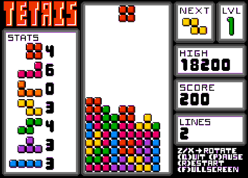

# tetris-clone

A Tetris implementation for OSX written in C++ with SDL 2.0 and SDL_gpu.
<br /><br />


<br /><br />


## To build. . . 

Clone this repository:
```
git clone https://github.com/strdavis/tetris-clone.git
```
<br />

Install SDL 2.0:
```
brew install sdl2
```
<br />

Install [SDL_gpu](https://github.com/grimfang4/sdl-gpu).
<br /><br />

Then build from the base directory of this repository using the XCode command line tools.
Note that the command-line tools now require an XCode install to use.
```
xcodebuild -project tetris.xcodeproj
```
<br />

And find the .app bundle in. . . 
```
build/Release/
```
<br /><br />

This software is released under the MIT license.

Copyright © 2020 Spencer Davis
